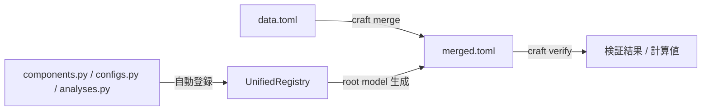

# コア概念

Craft の主要な抽象を理解するためのリファレンス。

---

## データフロー



---

## Component

宇宙機の物理コンポーネント（ハードウェア）を表す基底クラス。
`schema.Component` を継承するだけで Pydantic モデルが自動生成され、`UnifiedRegistry` に登録される。

```python
# systems/power/components.py
from schema import Component, fld

class Battery(Component):
    """二次電池。"""
    capacity_wh: float = fld(ge=0, unit="Wh", desc="Battery capacity")
    nominal_voltage_v: float = fld(ge=0, unit="V", default=0.0)

    class Design:
        depth_of_discharge: float = fld(ge=0, le=1)

    class Requirements:
        depth_of_discharge_max: float = fld(default=0.8, gt=0, le=1)
```

!!! warning "`from __future__ import annotations` は書かない"
    veriq の `inspect.signature` が実行時型を必要とするため、遅延評価になる
    `from __future__ import annotations` は **使用禁止**。型ヒントは常に実体を書く。

### Spec / Design / Requirements の使い分け

| セクション | 意味 | 典型的な内容 |
|---|---|---|
| **Spec** (クラス直下) | 選定データ（変更稀・カタログ値） | 容量・電圧・動作温度 |
| **Design** (inner class) | 設計パラメータ（変更頻度が中程度） | 放電深度・構成数 |
| **Requirements** (inner class) | 要求値・制約（変更稀・ミッション由来） | 上限値・下限値 |

### Singleton vs MultiInstance

| cardinality | 意味 | 宣言 |
|---|---|---|
| `single` (default) | 機体に 1 つだけ | trait なし |
| `multi` | 機体に複数存在 | `MultiInstance` trait を付ける |

```python
from schema import Component, MultiInstance, fld

class Battery(Component, MultiInstance):  # (1)
    capacity_wh: float = fld(ge=0, unit="Wh")
    ...
```

1. `MultiInstance` を付けると `data.toml` で複数インスタンスを定義できる。

### plural と TOML キー

クラス名から plural が自動生成される（例: `Battery` → `batteries`、`SolarPanel` → `solar_panels`）。
`data.toml` ではこの plural キーを使う。明示したい場合:

```python
class Battery(Component, plural="battery_cells"):
    ...
```

---

## fld()

Pydantic `Field()` の薄いラッパ。型推論が正しく通るよう `dataclass_transform` を使っている。
詳細は [fld() リファレンス](reference/fld.md) を参照。

```python
fld()                          # 必須フィールド (= ...)
fld(default=0.0)               # デフォルト値あり
fld(ge=0, le=1)                # バリデーション
fld(unit="Wh", desc="容量")    # メタ情報 (JSON Schema / Swagger に反映)
```

---

## Traits

Component に横断的な Spec / Design フィールドを注入するミックスイン。
詳細は [Traits リファレンス](reference/traits.md) を参照。

```python
from schema import Component, MultiInstance, TemperatureSensitive, fld

class Battery(Component, MultiInstance, TemperatureSensitive):
    capacity_wh: float = fld(ge=0, unit="Wh")
    # TemperatureSensitive が Spec に operating_temperature_min/max を自動追加
```

---

## Config

数値パラメータではなく、ミッション設計値・軌道パラメータ等の「設定」を表す。
`schema.Config` を継承する。Component と異なり、Design / Requirements の分割はなくフラット。

```python
# systems/mission/configs.py
from schema import Config, fld

class MissionConfig(Config):
    """ミッション基本パラメータ。"""
    orbit_altitude_km: float = fld(ge=200, desc="軌道高度")
    mission_lifetime_years: float = fld(ge=0)
```

`data.toml` での記述:

```toml
[mission_config]
orbit_altitude_km = 550.0
mission_lifetime_years = 3.0
```

---

## Analysis

veriq の calculation / verification として登録される計算関数。`@analysis` デコレータを使う。

```python
# systems/power/analyses.py
from typing import Annotated
import veriq as vq
from schema import analysis

@analysis(desc="全 PDM 消費電力合計 (W)")
def total_pdm_power_w(
    pdms: Annotated[vq.Table, vq.Ref("$.pdms")],
) -> float:
    return sum(
        p.spec.default_power_consumption_per_unit_w
        for p in pdms.values()
        if p.design.power_modes.get("nominal", False)
    )

@analysis(verify=True, desc="バッテリ DoD が要求を満たすか")
def verify_battery_capacity(
    batteries: Annotated[vq.Table, vq.Ref("$.batteries")],
) -> bool:
    return all(
        b.spec.capacity_wh * b.requirements.depth_of_discharge_max >= 50.0
        for b in batteries.values()
    )
```

| 引数 | 意味 |
|---|---|
| `verify=False` (default) | `scope.calculation` として登録 |
| `verify=True` | `scope.verification` として登録（戻り値は `bool`） |
| `imports=["orbital"]` | 他 system のデータを参照する場合 |
| `cache=True` | 結果をキャッシュ (ad-hoc analysis のみ有効) |
| `system=None` | veriq 非登録の ad-hoc analysis（直接実行のみ） |

!!! note "scope.py は編集不要"
    `@analysis` を追加するだけで自動的に scope に登録される。
    `scope.py` を編集するのは **新しい system を追加するとき** だけ。

---

## data.toml の書き方

`systems/<sub>/data.toml` では `<sub>.model.` プレフィックスを省略して記述する（`craft merge` が自動付与）。

### Singleton Component

```toml
[obc.spec]
processor_type = "ARM Cortex-M7"
clock_mhz = 120.0

[obc.design]
redundancy_level = 1
```

### MultiInstance Component (shared_spec)

`MultiInstance` は全インスタンス共通の `spec` を分離する。

```toml
[batteries.spec]              # 全インスタンス共通
capacity_wh = 100.0
nominal_voltage_v = 3.7

[batteries.main.design]       # instance "main" 固有
depth_of_discharge = 0.7

[batteries.main.requirements]
depth_of_discharge_max = 0.8

[batteries.aux.design]        # instance "aux" 固有
depth_of_discharge = 0.6
```

!!! tip "コメントは保持される"
    `craft merge` / `craft scaffold` では `tomlkit` を使うため、
    `data.toml` に書いたコメント・空行・順序は書き換え時も保持される。

---

## UnifiedRegistry

`schema.default_registry` に全定義が集まる。`Component.__init_subclass__` と `@analysis` が自動登録する。

```python
from schema import default_registry

default_registry.components(system="power")  # power の全 Component 定義
default_registry.analyses(system="power")    # power の全 Analysis 定義
default_registry.systems()                   # 登録済み system 名一覧
```

CLI での確認:

```bash
uv run craft schema list
```

---

## scope.py の役割

veriq と Craft を橋渡しするボイラープレート。**新しい system を追加するときだけ** 触る。

```python
# systems/power/scope.py
import veriq as vq
from core.paths import system_data_path
from schema import build_system_root_model, default_registry
from systems.power import analyses as _analyses  # noqa: F401
from systems.power import components as _components  # noqa: F401

power = vq.Scope("power")

def _build_and_attach():
    root_model = build_system_root_model("power", system_data_path("power"))
    power.root_model()(root_model)
    for adef in default_registry.analyses(system="power"):
        if adef.verify:
            power.verification(adef.name, imports=adef.imports)(adef.func)
        else:
            power.calculation(adef.name, imports=adef.imports)(adef.func)
    return root_model

PowerRootModel = _build_and_attach()
```
