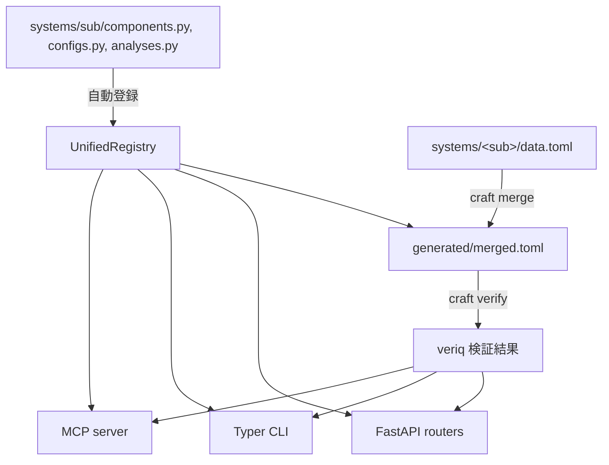

# Craft

**Concept Registry for Automated spacecraFT design**

宇宙機（衛星・深宇宙機含む）の概念設計を **型付き計算グラフ** として宣言的に記述する基盤。
`systems/<name>/components.py` に Python クラスを書くだけで、CLI / FastAPI / MCP (LLM agent) が自動的に配信される。

---

## 特徴

| 特徴 | 説明 |
|---|---|
| **宣言的** | Component クラスを定義するだけで API・CLI・MCP tool が自動生成。`api/` / `cli/` / `mcp_server/` には一切触れない。 |
| **型安全** | Pydantic v2 による完全な型検証。`fld()` で物理単位・制約・説明を宣言。JSON Schema が自動生成される。 |
| **veriq 統合** | `craft verify` 一発で全 system の merge + 検証パイプライン実行。verification 結果は runs history に永続化される。 |
| **マルチサーフェス** | 同一定義から CLI / REST API / MCP server の 3 surface を自動配信。Swagger UI から GUI で操作できる。 |

---

## クイックスタート

```bash
# 1. インストール
uv sync

# 2. 登録済みコンポーネントを確認
uv run craft schema list

# 3. merge + veriq 検証を実行
uv run craft verify

# 4. API サーバ起動 → http://localhost:8000/docs
uv run uvicorn api.main:app --reload

# 5. MCP サーバ起動（Claude Code / Desktop 等から接続）
uv run craft-mcp
```

## 3 つの surface

Component / Config / Analysis を 1 度だけ定義すると、以下の **3 つの surface** が
自動で同じ機能を公開する。

| Surface | 入口 | 主なユースケース | ドキュメント |
|---|---|---|---|
| **CLI** | `uv run craft <cmd>` | スクリプト・CI・端末からの操作 | [CLI リファレンス](reference/cli/index.md) |
| **REST API** | `uv run uvicorn api.main:app` | Web UI / 外部システム連携 / Swagger UI で GUI 操作 | [REST API リファレンス](reference/api.md) |
| **MCP サーバ** | `uv run craft-mcp` | Claude Code / Desktop 等の LLM エージェントから自然言語で操作 | [MCP リファレンス](reference/mcp.md) |

---

## アーキテクチャ



---

## ディレクトリ構成

```
craft/
├── schema/         # Component / Config base class, UnifiedRegistry, fld(), traits
├── core/           # TOML I/O, merge, scaffold, instance CRUD
├── api/            # FastAPI (routers/, errors.py, main.py)
├── cli/            # Typer CLI (craft コマンド)
├── mcp_server/     # MCP サーバ (craft-mcp, stdio)
├── systems/     # ユーザ領域 — ここだけ編集する
│   └── <name>/
│       ├── components.py
│       ├── configs.py
│       ├── analyses.py
│       ├── scope.py
│       └── data.toml
└── generated/      # merged.toml (生成物)
```

!!! tip "ユーザが触るのは `systems/` のみ"
    `schema/` / `core/` / `api/` / `cli/` / `mcp_server/` は基盤として固定されている。
    新しいコンポーネントを追加したいときは `systems/<name>/components.py` だけ編集する。

---

## 次のステップ

- [コア概念](concepts.md) — Component / Config / Analysis / Traits / `data.toml` の詳細
- [チュートリアル](tutorial.md) — 新しい system をゼロから追加するハンズオン
- [Analysis の書き方](guide/analysis.md) — veriq バインド型 / ad-hoc 型の使い分け
- [CLI リファレンス](reference/cli/index.md) — 全コマンドの詳細
- [REST API リファレンス](reference/api.md) — HTTP エンドポイント一覧（Swagger / ReDoc 同梱）
- [MCP リファレンス](reference/mcp.md) — Claude Code / Desktop からの操作と tool 体系
